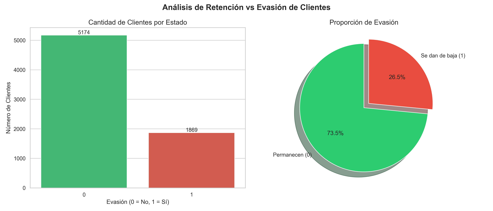
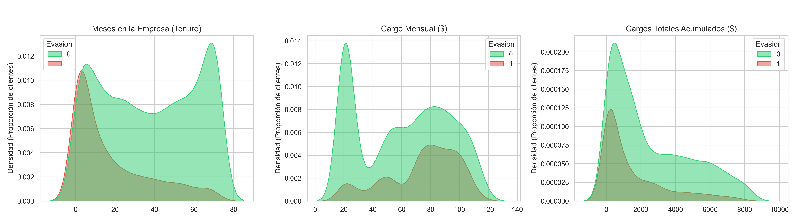
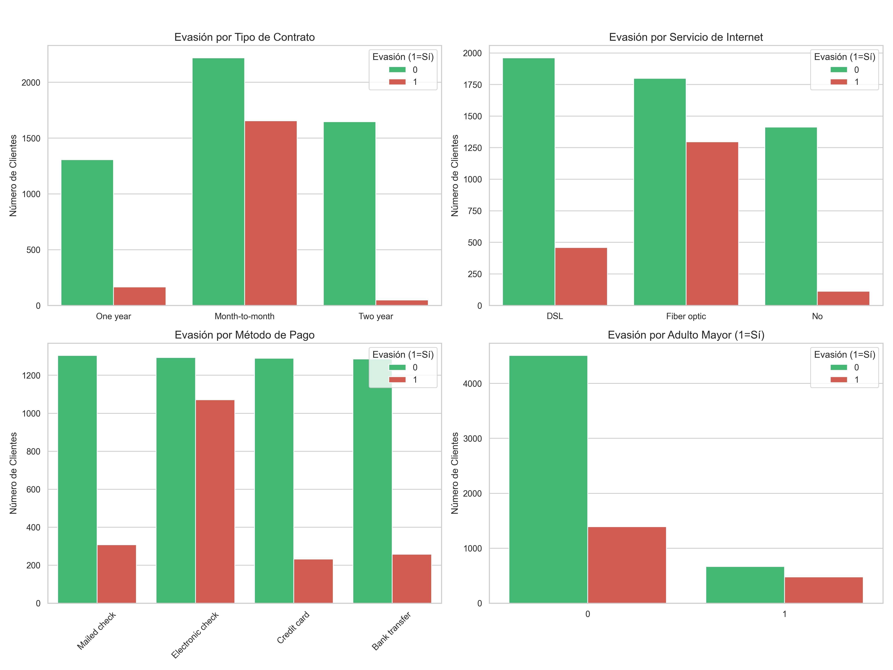
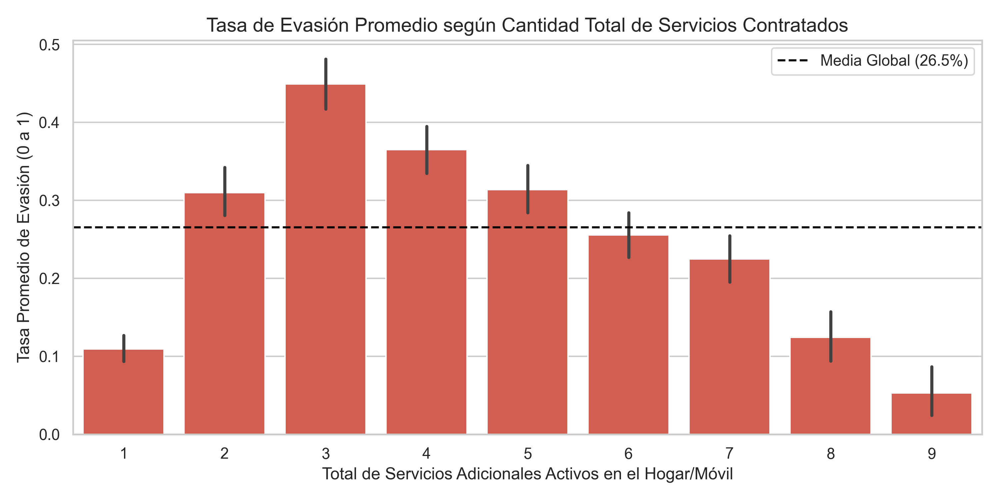

# 📊 Telecom X - Análisis de Evasión de Clientes (Churn Prediction)

Este proyecto aborda uno de los mayores desafíos en la industria de las telecomunicaciones: la evasión o retención de clientes (*Customer Churn*). 

Utilizando Python, Pandas y visualización de datos en Google Colab/Jupyter Notebook, hemos analizado una API en formato JSON con información detallada de los suscriptores de la telefónica **Telecom X** para extraer *insights* métricas y recomendaciones de negocio accionables orientadas a reducir esta fuga de capital.

## 🚀 Objetivo del Proyecto
El principal objetivo fue transformar datos crudos y anidados desde una fuente web (GitHub JSON) en un modelo descriptivo analítico completo que permita:
- Entender el perfil de los clientes que cancelan el servicio frente a los que permanecen.
- Limpiar e identificar inconsistencias ocultas en la facturación y los contratos.
- Obtener patrones cruzados usando visualizaciones estáticas para informar a la directiva o área comercial sobre los factores más críticos del abandono.

## 🛠️ Tecnologías y Librerías Utilizadas
El proyecto se basa enteramente en el ecosistema analítico de Python. Debe correrse en un entorno de notebooks interactivo (Jupyter / Google Colab).
- **Python 3.x**
- **Pandas**: Para la ingesta (`json_normalize`), aplanado del JSON, limpieza, binarización y feature engineering.
- **Requests**: Extracción de datos RESTful API.
- **Matplotlib & Seaborn**: Graficación estática avanzada (Countplots, Heatmaps, KDE Densities, Boxplots).

## 📥 Instalación y Configuración

Si deseas ejecutar este proyecto localmente fuera de Google Colab, asegúrate de tener instaladas las siguientes dependencias:

```bash
# Crear un entorno virtual (Recomendado)
python -m venv data_env
source data_env/bin/activate  # En Linux/Mac
data_env\Scripts\activate   # En Windows

# Instalar dependencias necesarias
pip install pandas requests matplotlib seaborn jupyter
```

## ⚙️ Uso / ¿Cómo ejecutarlo?

1. Clona o descarga el archivo principal Jupyter Notebook: `telecomx.ipynb`.
2. Ejecuta el servidor si trabajas en local mediante el comando `jupyter notebook` o abre el archivo `.ipynb` directamente en tu editor compatible (Ej: VS Code con extensiones). Alternativamente, súbelo a [Google Colab](https://colab.research.google.com/).
3. Corre las celdas de manera secuencial (hacia abajo). Todo el código está automatizado: descargará la información de Telecom X directamente desde GitHub y comenzará el análisis al instante sin necesidad de descargar archivos extra.

## 📈 Fases del Análisis y Metodología

El proyecto está dividido en etapas modulares claras dentro del código:

1. **Ingesta y Aplanado (Flattening):** Conversión de estructuras JSON fuertemente anidadas a una Dataframe 2D.
2. **Exploración de la estructura:** Verificación rápida mediante `info()` y `dtypes`.
3. **Limpieza Matemática e Inconsistencias:** Reparación de espacios blancos invisibles que convertían el `Cargo_Total` en *Strings*, e inyección del tipo de dato `float64`.
4. **Feature Engineering (Ingeniería de Características):** Creación de variables matemáticas nuevas como las `Cuentas_Diarias` (Gasto mensual / 30) para facilitar modelados futuros.
5. **Estandarización:** Renombramiento completo de la metadata al español en favor del equipo gerencial, y binarización (1/0) masiva de las respuestas categóricas dicotómicas ('yes'/'no').
6. **Análisis Descriptivo (EDA):** Detección matemática de distribuciones (media, max/mins, desviaciones).
7. **Visualización Segmentada:** Análisis profundo de la variable objetivo (Evasión/Churn) contra aspectos cualitativos (Ej: Tipo de Contrato) y cuantitativos (Ej: Permanencia o Cargos Totales).
8. **Análisis de Ecosistemas (Correlación Extra):** Matriz de calor de Pearson y hallazgos invaluables sobre la tenencia múltiple de servicios (Efecto *Lock-in*).

## 🔑 Resultados Clave (Insights de Negocio)
A través de las visualizaciones y cruces de este código, llegamos a las siguientes conclusiones críticas apoyadas en los datos del `describe()` y los gráficos:

- **Tasa de Evasión Global:** Se determinó que el **26.54%** de la cartera total de clientes ha cancelado el servicio. (Clases desbalanceadas).



- **El Peligro del Inicio (Tenure):** La curva de abandono (KDE) demuestra que la enorme mayoría de las fugas ocurren drásticamente durante los **primeros 5 meses** de servicio. El 75% de los clientes que cancelan, lo hacen antes del mes 30.
- **Problema de Costos (Cargos Mensuales):** La densidad de cancelación sube brutalmente para los clientes con facturas entre **$70 y $100**. La mediana de cargo mensual de los que se van es muy superior a la de los que permanecen (~$80 vs ~$60).



- **El Tipo de Contrato:** Los contratos *Month-to-month* (mes a mes) son la cuna absoluta del *Churn*. Los contratos de 1 a 2 años reducen la deserción casi al 0%.
- **Fibra Óptica en Riesgo:** Sorprendentemente, los clientes de conexión costosa de Fibra Óptica son mucho más propensos a irse rápida y agresivamente que los usuarios del viejo ADSL regular.



- **El Santo Grial (Efecto Lock-In):** Clientes con un solo servicio o servicios aislados tienen una enorme probabilidad de deserción (rozando el **40%**). Sin embargo, cuando logramos crear un ecosistema vendiendo al mismo cliente **6, 7 o más servicios integrados** (Teléfono, Internet, Seguridad, TV y Soporte Técnico), la probabilidad de abandono se desploma a niveles casi nulos (**< 5%**).




---
*Este análisis explicatorio inicial marca la línea base perfecta requerida para alimentar, en un siguiente sprint técnico, modelos predictivos de Inteligencia Artificial (Ej: Random Forests o Regresión Logística) que detecten en tiempo real si un usuario está próximo a fugarse para retenerlo a tiempo.*
